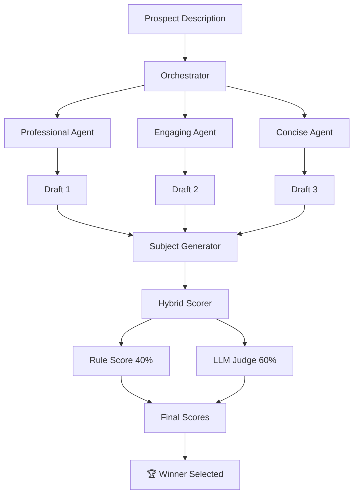

# 🚀 TMP AI Sales Outreach Agent

**An intelligent, multi-agent system for generating high-performance cold outreach emails.**

This project uses a sophisticated multi-agent architecture to draft, evaluate, and optimize sales emails. Instead of relying on a single prompt, it orchestrates **three distinct AI personas** to generate options, then uses a **Hybrid Scoring System** (Rule-Based + LLM Judge) to mathematically determine the best draft.


---

## ✨ Key Features

### 🤖 Multi-Persona Generation
Simultaneously generates drafts using three specialized SDR agents:

| Agent | Style | Best For |
|-------|-------|----------|
| **👔 Professional** | Value-focused, ROI-driven | C-suite, Enterprise |
| **💡 Engaging** | Pattern interrupts, conversational | Startups, Marketing |
| **⚡ Concise** | Ultra-brief, bullet-point | Busy executives |

### 📊 Hybrid Scoring Engine
- **Rule-Based (40%)**: Checks length, structure, keywords, spam triggers, CTA quality
- **LLM Judge (60%)**: Evaluates persuasiveness, tone, clarity, personalization
- **Improvement Suggestions**: Actionable feedback for each draft

### 🎯 Professional-Grade Prompts
World-class prompt engineering using:
- Rich persona with motivation & goals
- Chain-of-thought reasoning framework
- Few-shot examples (good & bad)
- Negative constraints (what to avoid)
- Dynamic context injection

### 🔧 Production-Ready Architecture
- Pydantic settings with validation
- Structured logging
- Cost tracking per run
- Memory persistence for learning
- Comprehensive test suite

---

## 📁 Project Structure

```
Sales-Outreach-Agent/
├── config/                    # Configuration
│   ├── settings.py           # Pydantic settings with validation
│   └── prompts/              # Externalized prompt templates
│       ├── professional_sdr.md
│       ├── engaging_sdr.md
│       ├── concise_sdr.md
│       └── email_judge.md
│
├── src/                       # Source code
│   ├── agents/               # Agent definitions
│   │   ├── sdr_agents.py     # SDR personas
│   │   ├── judge_agent.py    # Email evaluator
│   │   └── subject_agent.py  # Subject line generator
│   │
│   ├── scoring/              # Scoring logic
│   │   ├── rule_scorer.py    # Rule-based scoring
│   │   ├── llm_scorer.py     # LLM-based scoring
│   │   └── hybrid_scorer.py  # Combined scoring
│   │
│   ├── pipeline/             # Orchestration
│   │   └── orchestrator.py   # Main pipeline
│   │
│   └── utils/                # Utilities
│       ├── cost_tracker.py   # API cost tracking
│       ├── cache.py          # Response caching
│       ├── memory.py         # Agent memory
│       └── logging.py        # Structured logging
│
├── app/                       # Application layer
│   ├── gradio_app.py         # Web UI
│   └── api.py                # REST API
│
├── tests/                     # Test suite
│   ├── test_scoring.py
│   └── test_settings.py
│
├── main.py                    # Entry point
├── .env.example              # Environment template
└── requirements.txt          # Dependencies
```

---

## 🛠️ Installation

### 1. Clone the repository

```bash
git clone https://github.com/Terry-Mathew/Sales-Outreach-Agent.git
cd Sales-Outreach-Agent
```

### 2. Create virtual environment

```bash
python -m venv venv

# Windows
venv\Scripts\activate

# macOS/Linux
source venv/bin/activate
```

### 3. Install dependencies

```bash
pip install -r requirements.txt
```

### 4. Configure environment

```bash
# Copy the example env file
cp .env.example .env

# Edit .env and add your OpenAI API key
# OPENAI_API_KEY=sk-...
```

---

## 🖥️ Usage

### Gradio Web UI (Default)

```bash
python main.py
```

Open http://localhost:7860 in your browser.

### REST API

```bash
python main.py --api
```

API docs available at http://localhost:8000/docs

### CLI Options

```bash
python main.py --help

Options:
  --api           Run FastAPI server instead of Gradio UI
  --port PORT     Custom port (default: 7860 for Gradio, 8000 for API)
  --share         Create a public Gradio share link
  --reload        Enable auto-reload for development (API only)
```

---

## 🔧 Configuration

All settings can be configured via environment variables or `.env` file:

| Variable | Default | Description |
|----------|---------|-------------|
| `OPENAI_API_KEY` | *required* | Your OpenAI API key |
| `PRIMARY_MODEL` | `gpt-4o-mini` | Model for SDR agents |
| `JUDGE_MODEL` | `gpt-4o-mini` | Model for email evaluation |
| `RULE_SCORE_WEIGHT` | `0.40` | Weight for rule-based scoring |
| `LLM_SCORE_WEIGHT` | `0.60` | Weight for LLM scoring |
| `MAX_COST_PER_RUN` | `0.50` | Budget limit per run (USD) |
| `LOG_LEVEL` | `INFO` | Logging level |
| `COMPANY_NAME` | `TMP AI Consulting` | Your company name for emails |

See `.env.example` for the full list of options.

---

## 📡 API Endpoints

### Generate Emails

```http
POST /generate
Content-Type: application/json

{
  "prospect_description": "CEO of a 50-person marketing agency...",
  "generate_subjects": true
}
```

### Response

```json
{
  "success": true,
  "chosen_agent": "Professional",
  "winning_score": 85,
  "winning_subject": "Quick thought on your marketing automation",
  "winning_body": "Hi Marcus...",
  "all_drafts": [...],
  "costs": {
    "api_calls": 7,
    "estimated_cost_usd": 0.014
  }
}
```

### Other Endpoints

- `GET /health` - Health check
- `GET /agents` - List available SDR personas

---

## 🧪 Testing

```bash
# Run all tests
pytest

# Run with coverage
pytest --cov=src

# Run specific test file
pytest tests/test_scoring.py -v
```

---

## 🧠 How It Works



1. **Drafting**: Orchestrator sends prompt to all three SDR agents in parallel
2. **Subject Generation**: Each draft gets an optimized subject line
3. **Rule Scoring**: Python logic analyzes structure, length, keywords, spam triggers
4. **LLM Scoring**: Judge agent evaluates persuasiveness, tone, clarity
5. **Selection**: Weighted score (40% rules + 60% LLM) determines winner

---

## 📈 Roadmap

- [ ] Add A/B testing for subject lines
- [ ] Integrate with CRM systems (HubSpot, Salesforce)
- [ ] Email sequence generation (multi-touch campaigns)
- [ ] Prospect research agent (LinkedIn, company website)
- [ ] Response prediction scoring
- [ ] Fine-tuned models for specific industries

---

## 🤝 Contributing

Contributions are welcome! Please feel free to submit a Pull Request.

---

## 📄 License

This project is licensed under the MIT License - see the [LICENSE](LICENSE) file for details.

---

## 🙏 Acknowledgments

- Built with [OpenAI Agents SDK](https://github.com/openai/openai-agents)
- UI powered by [Gradio](https://gradio.app/)
- API powered by [FastAPI](https://fastapi.tiangolo.com/)
